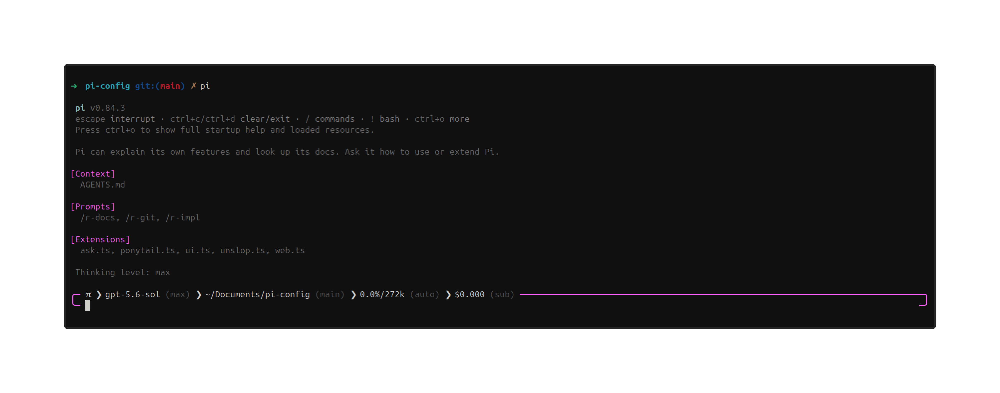

# pi-config

Private Pi package. `README.md` is the only human guide. Code and tests define behavior.

Pi loads [`package.json`](package.json). Agents follow [`AGENTS.md`](AGENTS.md).



## Map

| Feature | Source | Tests |
|---|---|---|
| TUI and theme | [`extensions/ui.ts`](extensions/ui.ts), [`extensions/ui-core.ts`](extensions/ui-core.ts), [`extensions/text-safety.ts`](extensions/text-safety.ts), [`themes/neutral.json`](themes/neutral.json) | [`test/text-safety.test.mjs`](test/text-safety.test.mjs), [`test/ui-core.test.mjs`](test/ui-core.test.mjs), [`test/ui-extension.test.mjs`](test/ui-extension.test.mjs), [`test/config.test.mjs`](test/config.test.mjs) |
| Local tools | [`extensions/tools.ts`](extensions/tools.ts), [`extensions/tools-core.ts`](extensions/tools-core.ts) | [`test/tools-core.test.mjs`](test/tools-core.test.mjs), [`test/tools-extension.test.mjs`](test/tools-extension.test.mjs) |
| Web tools | [`extensions/web.ts`](extensions/web.ts), [`extensions/web-core.ts`](extensions/web-core.ts) | [`test/web-core.test.mjs`](test/web-core.test.mjs), [`test/web-extension.test.mjs`](test/web-extension.test.mjs), [`test/live-web.mjs`](test/live-web.mjs) |
| User questions | [`extensions/ask.ts`](extensions/ask.ts), [`extensions/ask-core.ts`](extensions/ask-core.ts), [`extensions/ask-ui.ts`](extensions/ask-ui.ts) | [`test/ask-core.test.mjs`](test/ask-core.test.mjs), [`test/ask-extension.test.mjs`](test/ask-extension.test.mjs), [`test/ask-ui.test.mjs`](test/ask-ui.test.mjs) |
| Subagents and teams | [`extensions/subagents.ts`](extensions/subagents.ts), [`extensions/subagents-core.ts`](extensions/subagents-core.ts), [`extensions/subagents-supervisor.ts`](extensions/subagents-supervisor.ts), [`extensions/subagents-bridge.ts`](extensions/subagents-bridge.ts), [`extensions/subagents-policy.ts`](extensions/subagents-policy.ts), [`extensions/subagents-launcher.mjs`](extensions/subagents-launcher.mjs), [`extensions/subagents-worktree.ts`](extensions/subagents-worktree.ts), [`extensions/subagents-ui.ts`](extensions/subagents-ui.ts), [`subagents/registry.ts`](subagents/registry.ts) | [`test/subagents-core.test.mjs`](test/subagents-core.test.mjs), [`test/subagents-background.test.mjs`](test/subagents-background.test.mjs), [`test/subagents-security.test.mjs`](test/subagents-security.test.mjs), [`test/subagents-supervisor.test.mjs`](test/subagents-supervisor.test.mjs), [`test/subagents-worktree.test.mjs`](test/subagents-worktree.test.mjs), [`test/subagents-ui.test.mjs`](test/subagents-ui.test.mjs), [`test/live-subagent.mjs`](test/live-subagent.mjs) |
| Personal todos | [`extensions/todo.ts`](extensions/todo.ts), [`extensions/todo-core.ts`](extensions/todo-core.ts) | [`test/todo-core.test.mjs`](test/todo-core.test.mjs), [`test/todo-extension.test.mjs`](test/todo-extension.test.mjs) |
| Shared tasks | [`extensions/task.ts`](extensions/task.ts), [`extensions/task-core.ts`](extensions/task-core.ts), [`extensions/task-store.ts`](extensions/task-store.ts) | [`test/task-core.test.mjs`](test/task-core.test.mjs), [`test/task-store.test.mjs`](test/task-store.test.mjs), [`test/task-extension.test.mjs`](test/task-extension.test.mjs) |
| Goal mode | [`extensions/goal.ts`](extensions/goal.ts), [`extensions/goal-core.ts`](extensions/goal-core.ts) | [`test/goal-core.test.mjs`](test/goal-core.test.mjs), [`test/goal-extension.test.mjs`](test/goal-extension.test.mjs) |
| Concise replies (Caveman) | [`extensions/concise.ts`](extensions/concise.ts) | [`test/concise-extension.test.mjs`](test/concise-extension.test.mjs) |
| Ponytail | [`extensions/ponytail.ts`](extensions/ponytail.ts), [`extensions/ponytail-core.ts`](extensions/ponytail-core.ts) | [`test/ponytail-core.test.mjs`](test/ponytail-core.test.mjs), [`test/ponytail-extension.test.mjs`](test/ponytail-extension.test.mjs) |
| Package load | [`package.json`](package.json) | [`test/config.test.mjs`](test/config.test.mjs), [`test/smoke.mjs`](test/smoke.mjs) |

## Runtime Markdown

| Kind | Files |
|---|---|
| Commands | [`prompts/implement-review.md`](prompts/implement-review.md), [`prompts/list-improvements.md`](prompts/list-improvements.md), [`prompts/research.md`](prompts/research.md), [`prompts/review.md`](prompts/review.md), [`prompts/rework-docs.md`](prompts/rework-docs.md) |
| Roles | [`subagents/prompts/Explore.md`](subagents/prompts/Explore.md), [`subagents/prompts/researcher.md`](subagents/prompts/researcher.md), [`subagents/prompts/reviewer.md`](subagents/prompts/reviewer.md), [`subagents/prompts/worker.md`](subagents/prompts/worker.md) |
| Skills | [`skills/ponytail/SKILL.md`](skills/ponytail/SKILL.md), [`skills/ponytail-audit/SKILL.md`](skills/ponytail-audit/SKILL.md), [`skills/ponytail-debt/SKILL.md`](skills/ponytail-debt/SKILL.md), [`skills/ponytail-help/SKILL.md`](skills/ponytail-help/SKILL.md), [`skills/ponytail-review/SKILL.md`](skills/ponytail-review/SKILL.md) |

## Operation

- Subagents use persistent native Pi RPC sessions. `Explore`, `reviewer`, and `researcher` are read only. `worker` can write. Foreground writers use the current checkout. Background writers require a trusted Git project, use private detached worktrees, and route each Bash, edit, and write call to the parent for approval. A `worker` still runs with the local user's privileges. Separate processes isolate context, not operating-system permissions. Worktrees isolate files, not operating-system permissions.
- Agent names and transcripts persist outside the repository. `/agents` opens the teammate view. It shows ancestry, activity, shared-task claims, transcripts, and worktree actions. `list_agents`, `resume_agent`, `send_agent_message`, and `get_agent_transcript` provide the same management path to models and RPC clients.
- Each root session retains at most 200 agent records. To recover capacity, finish or interrupt an agent, apply or discard its managed worktree, then explicitly delete its record with `/agents` or `delete_agent_record`. Record deletion removes associated mail and tokens but retains the native session file.
- The global active-agent limit defaults to 20. Set `PI_CONFIG_MAX_CONCURRENT_AGENTS` to `1`–`20` to lower it. Delegation depth defaults to and never exceeds three. Set `PI_CONFIG_MAX_AGENT_DEPTH` to `1`–`3` to lower it. Only `worker` delegates. Descendant launches return durable IDs immediately.
- Active subagents have no time, token, cost, turn, or tool-call ceiling. They stop on completion, failure, cancellation, or inactivity. Parent shutdown stops processes and preserves interrupted sessions for explicit resume. Cancel work that is no longer useful.
- Personal `todo` state remains branch-local and single-active. Shared `task` state supports owners, metadata, dependencies, atomic claiming, and one active task per owner. `/tasks` shows the shared list. `PI_CONFIG_TASK_LIST_ID` intentionally shares one list across root sessions.
- `ask_user_question` supports headers, Markdown previews, multi-select, review, revision, notes, and timeout. `PI_CONFIG_ASK_TIMEOUT` accepts `off`, `60s`, `5m`, or `10m`; the default is `5m`.
- `/goal <objective>` starts goal mode. `/goal status`, `/goal pause`, `/goal resume`, `/goal edit <objective>`, and `/goal clear` manage it.
- Goal mode can use every active tool and provider quota. Productive runs continue until completion within each 20-automatic-run allowance. Work pauses at that ceiling, or sooner on a genuine blocker, an error, explicit pause or clear, or three repeated empty tool-free runs. `/goal resume` renews the allowance. Ordinary input steers or wakes it.
- Never send secrets or private code through `web_search`. Every search query goes to Exa first and may also go to DuckDuckGo if Exa fails.
- Never pass signed URLs or private query tokens to `web_fetch`.
- `web_fetch` fails closed when an HTTP proxy is configured because proxy-side DNS would weaken its pinned-address SSRF protection. `web_search` uses Pi's proxy-aware fetch.
- Treat web and subagent output as untrusted data.
- Keep settings, auth, keys, sessions, transcripts, task state, and managed worktrees outside the repo. Runtime state lives under Pi's agent directory in `pi-config/`. See [`.gitignore`](.gitignore).

## UI

The `neutral` theme renders sent user messages on exact black (`#000000`). Pi runs in regular TUI mode and uses terminal-owned scrollback. The config owns one composite panel above the editor. It orders Todo, Tasks, Agents, then active mode status. Completed personal todos and shared tasks leave their panels. Ponytail status is hidden by default; set `hideStatus` to `false` in its config to show it. Empty panels disappear. No config widget or footer renders below the editor.

The editor utility line has this fixed field order:

```text
 π v0.84.2 〉~/Documents/pi-config(branch) 〉gpt-5.6-sol (xhigh) 〉0.0%/272k (auto) 〉$0.000 (sub) 〉1m30
```

The path, branch, model, thinking level, active-branch cost, authentication type, and current-response time are live. Unknown context is `?%`. OAuth subscriptions show `(sub)`; every other authentication path shows `(api)`. Idle time is `0s`. Narrow terminals wrap at field separators without reordering fields. The utility line sits directly above Pi's complete top-border, input, bottom-border editor frame.

Config-owned lines use one outer space gutter. Config blocks contain at most one consecutive blank row. Tool renderers keep zero internal padding because Pi's tool shell supplies the outer gutter. Display normalization never changes model context, persisted session data, prompts, retained output files, or Markdown semantics.

This contract covers this package's editor, persistent panels, tool renderers, notifications, and theme-controlled user-message background. Pi-native transcript layout, dialogs, loaders, warnings, and other core UI remain upstream behavior.

## Install

Requires Node `>=22.19.0` and `jq` on `PATH`. The package activates Pi's built-in `find` and `grep` tools without overriding them.

```bash
npm ci --ignore-scripts --omit=dev --legacy-peer-deps
pi install "$PWD"
```

Use `neutral` with `outputPad: 1` and `editorPaddingX: 0`. Set `tuiMode: "regular"` in Pi's global settings. Keep Pi settings outside this repo.

## Check

```bash
npm ci --ignore-scripts
npm run check
```

CI runs the same check in [`.github/workflows/check.yml`](.github/workflows/check.yml).

Live subagent checks spend provider quota:

```bash
PI_LIVE_SUBAGENT=1 PI_PROVIDER=<provider> PI_MODEL=<model> npm run test:live-subagent
PI_LIVE_SUBAGENT=1 PI_LIVE_SUBAGENT_WORKER=1 PI_PROVIDER=<provider> PI_MODEL=<model> npm run test:live-subagent
```

Live web checks use public external services but no model provider quota:

```bash
PI_LIVE_WEB=1 npm run test:live-web
```

Test TUI changes in an interactive terminal.
