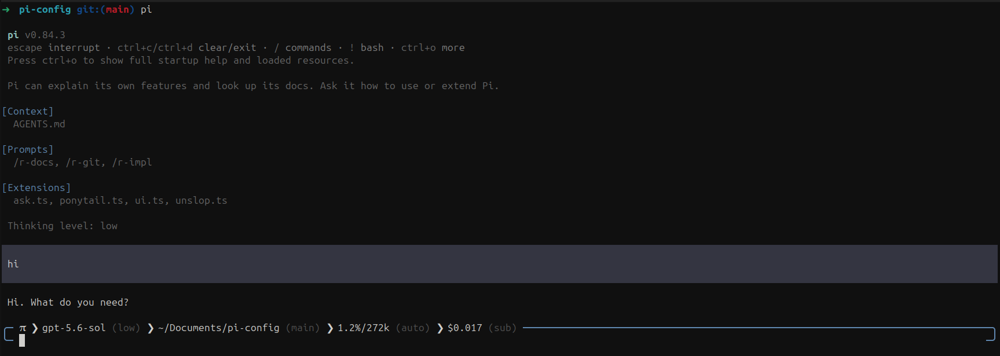

# pi-config

This private Pi package adds a custom TUI, structured questions, repository
commands, and fixed Ponytail and Unslop policies. Pi owns models,
authentication, settings, sessions, and transcripts. Contributors must follow
[`AGENTS.md`](https://github.com/txreverted/pi-config/blob/main/AGENTS.md).



## Use

Requires Node 22.19.0 or newer.

```sh
npm ci --ignore-scripts
npm run check
npx --no-install pi -e "$PWD"
```

`npm ci` may contact the registry. Pi loads this package with the user's
permissions. Submitted prompts may make paid provider calls. Policies
do not control filesystem, shell, network, Git, or provider access.

## Change

- [`extensions/ui.ts`](extensions/ui.ts) customizes the TUI editor and footer.
  The current thinking-level color applies to the editor border, status labels,
  Markdown headings, loaded resource labels, and streaming spinner.
  Thinking-level changes do not add rows or change expansion state. The status
  shows the model, thinking level, working directory, Git branch, context usage,
  recorded session cost, and subscription marker. Multiline input has side
  corners and no bottom border. Consecutive empty lines collapse to one while
  terminal image rows retain their reserved height.
- [`extensions/ask.ts`](extensions/ask.ts) provides `ask_user_question` in TUI
  and RPC sessions. It accepts one to four single- or multi-select questions,
  two to four choices per question, and an automatic `Other` choice. Custom
  answers are sanitized and limited to 2,000 UTF-8 bytes and 400 lines.
  Truncation is reported. The metadata estimate is at most 400 tokens.
- [`extensions/ponytail.ts`](extensions/ponytail.ts) and
  [`extensions/unslop.ts`](extensions/unslop.ts) append fixed policies to each
  turn's system prompt in that order. Their combined Pi estimate is at most 2,000 tokens.
  [`policies/unslop.md`](policies/unslop.md) is runtime policy code.
- [`/r-docs [scope]`](prompts/r-docs.md) rebuilds human documentation from
  verified repository facts. It permits replacing dirty in-scope docs without confirmation
  and prepares replacements before any write or deletion.
- [`/r-git`](prompts/r-git.md) separates dirty work into checked pull requests,
  pushes them, waits for required gates, and merges green PRs without confirmation.
  It changes remote repositories.
- [`/r-impl [scope]`](prompts/r-impl.md) audits behavior and implementation size
  without editing unless asked. The three default prompt expansions combine to at most 775 tokens.

Policy text adapts pinned MIT sources: [Ponytail](https://github.com/DietrichGebert/ponytail/blob/2ed6c52c9d7e5e56942508591085fd45dea277d3/skills/ponytail/SKILL.md),
[Unslop](https://github.com/cursor/plugins/blob/99559f2f52047978602ef365589275831e76af07/pstack/skills/unslop/SKILL.md),
and [Caveman](https://github.com/JuliusBrussee/caveman/blob/2f49f0e1a352aa810e70056b7930aeb0b3d219b4/src/rules/caveman-activate.md).
Their notices are [`ponytail.LICENSE`](policies/ponytail.LICENSE),
[`unslop.LICENSE`](policies/unslop.LICENSE), and
[`caveman.LICENSE`](policies/caveman.LICENSE).

## Verify

`npm run check` is the canonical check. It type-checks, tests, packs the
production files, installs the tarball without development dependencies, and
loads its resources through isolated offline Pi state. It makes no model calls.
See [`test/`](https://github.com/txreverted/pi-config/tree/main/test) and
[CI](https://github.com/txreverted/pi-config/actions/workflows/check.yml).

## Troubleshoot

- Restart Pi after source changes.
- Stop Pi with `/quit` or Ctrl+C twice.
- Check [`package.json`](package.json) for enabled extensions and prompt paths.
- Run only `npm run check` after code or runtime prompt changes.
- Never commit credentials, auth settings, Pi state, sessions, or transcripts.
  See [`.gitignore`](https://github.com/txreverted/pi-config/blob/main/.gitignore).
